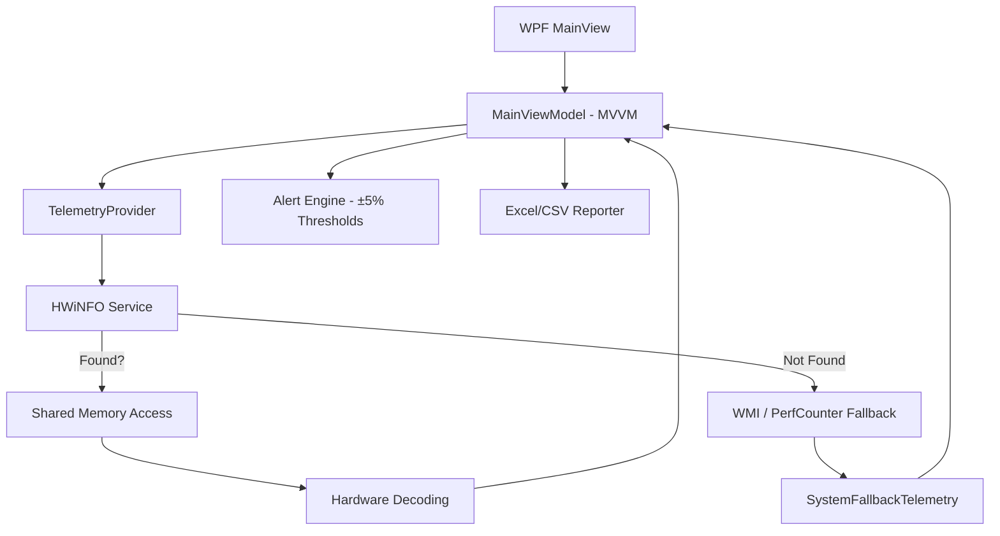

# 📊 Pro Hardware Monitor (Sentinel Watch)

A professional-grade system telemetry and hardware monitoring application built with **WPF** and **.NET 8**. Designed for power users and system builders, Sentinel Watch provides millisecond-accurate tracking of voltages, temperatures, and fan speeds with robust failover mechanisms.

## 🏗️ Technical Architecture: Hybrid Telemetry

The application implements a "Smart Fallback" strategy to ensure data availability even when specialized drivers are missing.

### Key Technical Features

| Feature | Description |
| :--- | :--- |
| **ATX Standard Alerts** | Integrated ±5% voltage tolerance monitoring for +12V, +5V, and +3.3V rails based on ATX Power Supply Design Guide. |
| **Shared Memory Engine** | Directly interfaces with HWiNFO64's shared memory buffer for low-latency high-precision sensor data. |
| **WMI Telemetry** | A standalone secondary engine that gathers CPU/RAM/GPU data using Windows Management Instrumentation. |
| **Professional Reporting** | Generates color-coded Excel charts using the **EPPlus** engine, featuring conditional formatting for temperature spikes. |

## 🛠️ Tech Stack
- **UI Framework**: WPF (Windows Presentation Foundation)
- **Pattern**: MVVM (Model-View-ViewModel) with CommunityToolkit.Mvvm
- **Data Export**: EPPlus (Excel Core), ClosedXML
- **System Access**: WMI, Performance Counters, Shared Memory APIs

## 🚀 Getting Started

### Prerequisites
- **HWiNFO64** (Optional but recommended for full sensor data).
- .NET 8.0 Desktop Runtime.

### Installation
1. Download the latest `SentinelWatch.exe`.
2. Run as Administrator (Required for HWiNFO shared memory access).
3. The dashboard will automatically detect your sensors and begin logging.

---
**Sentinel Data Solutions** | *Precision System Monitoring*
**Developed by Zeca**
